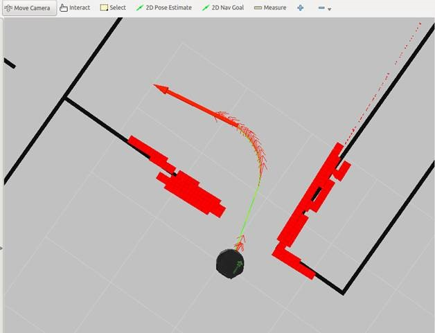
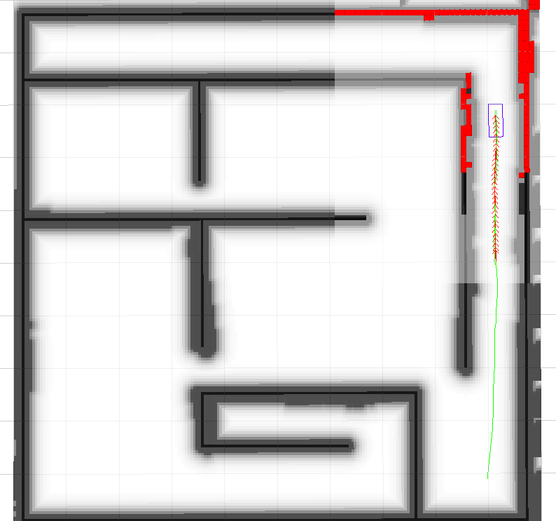

# Navigation_stack

# gmapping

# cartographer

## 常见问题

### 1. 使用imu时地图建反了

cartographer通过判断imu的g的方向判定哪个为z轴

而其判断的为正值+g，因此若imu输出为-g则建图会相反

### 2. F1228 10:32:13.000000 22824 map_by_time.h:43] Check failed: data.time > std::prev(trajectory.end())->first (621355968800740000 vs. 621355968800740000)

https://github.com/googlecartographer/cartographer_ros/issues/1143

传感器发布的时间存在重合，可能是cartographer的采样频率较低，且判断精度较低导致

提高仿真时间，或降低传感器节点发布频率，使时间戳区分大些

`odometry_sampling_ratio = 1.,`

`imu_sampling_ratio = 1.,`

改为0.2就可以在50ms仿真下正常运行

### 3. 如何保存为地图

rosservice call /write_state /home/chrisliu/ROS/cartographer_ws/RaceMap.pbstream true
rosrun cartographer_ros cartographer_pbstream_to_ros_map -pbstream_filename /home/chrisliu/ROS/cartographer_ws/RaceMap.pbstream -map_filestem /home/chrisliu/ROS/cartographer_ws/RaceMap

# amcl

# move_base

## 1.输入

## 2.输出

/cmd_vel

输出为：

**速度（m/s)**

**角速度（rad/s)**

只需确保自己的底盘模型的输入量是以上数据就能保证正常运行

**×有许多遥控底盘模型实际没有做准确的数学建模**

**×很多根据自己希望的速度随便加系数可能导致导航不能良好运行**

## 3.参数

#### Parameters

`~base_global_planner` (`string`, default: `"navfn/NavfnROS"` **For 1.1+ series**)

- The name of the plugin for the global planner to use with `move_base`, see [pluginlib](http://wiki.ros.org/pluginlib) documentation for more details on plugins. This plugin must adhere to the `nav_core::BaseGlobalPlanner` interface specified in the [nav_core](http://wiki.ros.org/nav_core) package. (**1.0 series default:** `"NavfnROS"`)

`~base_local_planner` (`string`, default: `"base_local_planner/TrajectoryPlannerROS"` **For 1.1+ series**)

- The name of the plugin for the local planner to use with `move_base` see [pluginlib](http://wiki.ros.org/pluginlib) documentation for more details on plugins. This plugin must adhere to the `nav_core::BaseLocalPlanner` interface specified in the [nav_core](http://wiki.ros.org/nav_core) package. (**1.0 series default:** `"TrajectoryPlannerROS"`)

`~recovery_behaviors` (`list`, default: [{name: conservative_reset, type: clear_costmap_recovery/ClearCostmapRecovery}, {name: rotate_recovery, type: rotate_recovery/RotateRecovery}, {name: aggressive_reset, type: clear_costmap_recovery/ClearCostmapRecovery}] **For 1.1+ series**)

- A list of recovery behavior plugins to use with `move_base`, see [pluginlib](http://wiki.ros.org/pluginlib) documentation for more details on plugins. These behaviors will be run when `move_base` fails to find a valid plan in the order that they are specified. After each behavior completes, `move_base` will attempt to make a plan. If planning is successful, `move_base` will continue normal operation. Otherwise, the next recovery behavior in the list will be executed. These plugins must adhere to the `nav_core::RecoveryBehavior` interface specified in the [nav_core](http://wiki.ros.org/nav_core) package. (**1.0 series default:** [{name: conservative_reset, type: ClearCostmapRecovery}, {name: rotate_recovery, type: RotateRecovery}, {name: aggressive_reset, type: ClearCostmapRecovery}]). Note: For the default parameters, the aggressive_reset behavior will clear out to a distance of 4 * `~/local_costmap/circumscribed_radius`.

`~controller_frequency` (`double`, default: 20.0)

- The rate in Hz at which to run the control loop and send velocity commands to the base.

`~planner_patience` (`double`, default: 5.0)

- How long the planner will wait in seconds in an attempt to find a valid plan before space-clearing operations are performed.

`~controller_patience` (`double`, default: 15.0)

- How long the controller will wait in seconds without receiving a valid control before space-clearing operations are performed.

`~conservative_reset_dist` (`double`, default: 3.0)

- The distance away from the robot in meters beyond which obstacles will be cleared from the [costmap](http://wiki.ros.org/costmap_2d) when attempting to clear space in the map. Note, this parameter is only used when the default recovery behaviors are used for `move_base`.

`~recovery_behavior_enabled` (`bool`, default: `true`)

- Whether or not to enable the `move_base` recovery behaviors to attempt to clear out space.

`~clearing_rotation_allowed` (`bool`, default: `true`)

- Determines whether or not the robot will attempt an in-place rotation when attempting to clear out space. Note: This parameter is only used when the default recovery behaviors are in use, meaning the user has not set the `recovery_behaviors` parameter to anything custom.

`~shutdown_costmaps` (`bool`, default: `false`)

- Determines whether or not to shutdown the costmaps of the node when `move_base` is in an inactive state

`~oscillation_timeout` (`double`, default: 0.0)

- How long in seconds to allow for oscillation before executing recovery behaviors. A value of 0.0 corresponds to an infinite timeout. **New in navigation 1.3.1**

`~oscillation_distance` (`double`, default: 0.5)

- How far in meters the robot must move to be considered not to be oscillating. Moving this far resets the timer counting up to the `~oscillation_timeout` **New in navigation 1.3.1**

`~planner_frequency` (`double`, default: 0.0)

- The rate in Hz at which to run the global planning loop. If the frequency is set to 0.0, the global planner will only run when a new goal is received or the local planner reports that its path is blocked. **New in navigation 1.6.0**

`~max_planning_retries` (`int32_t`, default: -1)

- How many times to allow for planning retries before executing recovery behaviors. A value of -1.0 corresponds to an infinite retries.


## teb_local_planner

### 常见问题

#### 1.为什么我的机器人导航太靠近墙壁和/或切角？

**解决：**

- 在costmap配置中定义/增加通胀半径。
- 参数min_obstacle_dist可能会增加，但这可能会导致在小走廊或门中出现不希望的导航行为（请参阅轨迹中的间隙）。
- 本地规划器“遵循”全局规划中一个移动的虚拟目标。
- 因此，全局规划的中间位置显着影响本地规划的空间行为。
- 通过定义膨胀半径，全局规划更倾向于最低成本，因此规划与墙壁分离更高。
- 注意，teb_local_planner本身不考虑膨胀半径。
- 由此产生的运动是时间最优的w.r.t. 虚拟目标。
- 如果您希望更多地遵循全局路径，请参阅全局路径跟踪。
- 如果您的机器人撞到墙壁，您应该增加min_obstacle_dist或设置适当的足迹（请参阅本教程）。

#### 2.为什么我的机器人不能正确地遵循全球计划？

**解决：**

- 默认规划标准是时间最优性，但您可以轻松自定义它。
- 默认情况下，遵循全局规划是通过定位从本地代价地图范围内的中间全局规划位置获取的移动虚拟目标来实现的（特别是具有长度max_global_plan_lookahead_dist的全局计划的子集，但绝不会超出本地代价地图的边界）。
- 当前机器人位置和虚拟目标之间的本地规划受到优化，例如，最小化过渡时间。
- 如果机器人更愿意遵循全局规划而不是在最短时间内达到（虚拟）目标，那么第一个策略可能是显着减少max_global_plan_lookahead_dist。
- 但是不推荐这种方法，因为它减少了预测/计划范围并削弱了避开障碍的能力（虚拟目标在当前版本中是固定的，因此不需要优化）。相反，为了考虑全局路径跟踪，teb_local_planner能够沿全局计划注入吸引子（via-points）（吸引子之间的距离：global_plan_viapoint_sep，吸引力：weight_viapoint）。
- 有关详细信息，请参阅教程遵循全局计划（Via-Points）。

#### 3.导致以下行为的原因是什么？



**解决：**

- 参数min_obstacle_dist选择得太高。
- 只是一个例子：如果参数min_obstacle_dist设置为1米的距离，机器人会尝试与门的每一侧保持至少1米的距离。
- 但是如果门的宽度只有1米，优化器仍将计划通过门的中心（局部最小值：避障的结果是在中心相互抵消）。
- 但是为了满足每个姿势的最小距离，优化器沿着轨迹移动计划的姿势（含间隙！）。
- 目前，规划器未检测到此情况。 但是，如果存在任何冲突，可行性检查可能会检测到这种情况。
- 如果你真的必须与障碍物保持很远的距离，你就无法开过那扇门。
- 然后，您还必须正确配置您的全局规划（机器人足迹，膨胀半径等），以通过它进行全局规划。
- 否则减小最小距离，直到轨迹不包含任何大间隙。

#### 4.如果目标姿态在机器人后面，并且开始和目标姿态的方向相似，为什么机器人要切换方向？

**解决：**

- 如果目标是在本地地图里，它应该正常工作。否则，取决于全局规划者如何选择中间取向。
- teb_local_planner选择全局计划中的姿势作为中间目标，直到达到实际目标（全局计划的最后一个姿势）。
- 但是，由于并非所有全局规划都指定有效方向而仅指定位置（例如，navfn），因此teb_local_planner默认覆盖全局计划方向（参数global_plan_overwrite_orientation）。
- 它实现了前向定向运动，使得姿势的方向始终指向连续姿势。 这种前向模式足以满足许多应用。
- 但是，在某些情况下，您可能希望具有不同的行为。
- 请参考下图，其中机器人应沿着走廊后退。 选择目标方向与开始方向类似：


- 你可能会同意，在这种情况下改变方向是不合适的。
- 但是，您可以设置global_plan_overwrite_orientation=false 来考虑全局规划中的取向。
- 使用global_planner取代navfn的规划器提供了多种选择方向的策略。
- 在撰写时，实施以下策略：
  - None 无 (只有全局方向)
  - Forward 前进(方向指向路径上的下一个点)
  - Interpolate 插值(方向是开始和目标姿势的线性混合)
  - ForwardThenInterpolate (向前方向直到最后一个直线，然后线性混合直到目标姿势).
- 下图显示了在选择Interpolate模式的情况下teb_local_planner在上一个场景中的行为：



- Interpolate模式在这里表现得很完美。
- 但是，让我们假设走廊包含曲线，在这种情况下，插值不是我们想要的，因为它只是评估开始和目标方向。
- 向后是合适的（Forward + pi），但是，这还没有在global_planner包中实现（至少在这个pull请求被合并之前）。
- 在实际应用中，我们有时可能需要前进模式，有时需要后退模式，因此您需要提出更智能的策略，例如： 走廊检测（注意，只有全局规划器可以使用全局地图执行此操作）。
- 目前，您需要为此编写自己的全局规划器，或者您可以扩展全局规划器包。
- 注意，teb_local_planner参数allow_init_with_backwards_motion需要设置为true，以便开始和当前中间目标之间的轨迹（例如，从采样独特拓扑中获得）也用向后方向初始化（仅在目标落后于开头时具有相似性） 方向）。
- 这也允许机器人在本地代价地图中正确后退，即使除了最后的中间方向之外的所有方向都是向前的。

#### 5.计算本地规划对我的机器人来说需要太长时间。 我可以加快规划吗？

**解决：**

- 规划受到计算要求的优化。
- 然而，计算时间受许多参数的影响，并且通常可以通过专用的自调整参数集来实现令人满意的导航行为。
- 以下列表提供了显着影响计算时间的参数的简要概述和含义。

**本地costmap_2d配置**

- Local costmap_2d configuration (a rolling window is highly recommended!)
- width/height：
- 局部代价地图的大小：意味着最大轨迹长度和考虑了多少占用的单元（对计算时间的主要影响，但是如果太小：短预测/计划范围降低了自由度，例如用于避障）。
- resolution：
- 局部代价地图的分辨率：精细分辨率（小值）意味着需要优化的许多障碍（对计算时间的主要影响）。

**teb_local_planner的障碍/代价地图参数：**

- costmap_obstacles_behind_robot_dist
- 由于局部代价地图以当前机器人位置为中心，因此不必考虑机器人后面的所有障碍物。
- 为了允许安全的转弯行为，该值应该是非零的。 较高的值包括更多优化障碍。
- obstacle_poses_affected
- 考虑轨迹上的最近邻居的数量（增加每个障碍物的距离计算的数量）。
- 对于小障碍物和点障碍物，该值可以很小（<10）。
- 如果轨迹在靠近障碍物时不够平滑，则再次增加该值。
- footprint_model
- 机器人足迹模型影响运行时间，因为距离计算的复杂性增加（如果可能，避免多边形足迹）。
- 可以通过激活rviz中的teb标记来显示足迹。
- 通过注册/激活costmap_converter插件，还可以将costmap-obstacle预处理移动到另一个线程中。
- 这些插件旨在将局部代价地图单元（许多点障碍）转换为几何图元（点，线，多边形）。
- 还可以过滤障碍物内部的冗余单元或单元。
- 但到目前为止，可用的转换插件仍处于试验阶段，有许多更有效的方法可以预先处理成本映射。

**轨迹显示：**

- dt_ref
- 确定所需的轨迹分辨率：小值导致精细分辨率，从而更好地逼近动力学模型，但必须优化许多点（对优化时间的主要影响）。
- 太高的值（> 0.6s）可能导致不再可行的轨迹，因为动力学模型的近似性差（特别是在类似汽车的机器人的情况下）。
- max_global_plan_lookahead_dist
- 限制到虚拟目标的距离（沿着全局规划）并且因此限制经受优化的姿势的数量（姿势之间的时间距离约为dt_ref秒）。
- 但长度也受当地costmap大小的限制

**优化参数：**

- no_inner_iterations
- 每个“内迭代”中的解算器调用数。 高度影响计算时间，但也影响解决方案的质量。
- no_outer_iterations
- 每个采样间隔的外部迭代次数，指定调整轨迹的频率以计算dt_ref的频率以及更新障碍与计划姿势之间的关联的频率。
- 每次迭代都会调用求解器。 该值显着影响计算时间以及收敛性。
- weight_acc_lim_*
- 您可以通过将权重设置为0.0来忽略加速度限制。 通过这样做，可以降低优化的复杂性并因此减少计算时间。

**替代轨迹的并行计划：**

- enable_homotopy_class_planning
- 如果计算多个备选项时只有计时问题，请将备用计划设置为false或首先使用max_number_classes限制备选项的数量。
- max_number_classes
- 限制可以优化的替代轨迹的数量。 通常有两种选择就足够了（避免在左侧或右侧出现障碍）。
- 还有关于roadmap_graph（roadmap_graph_ *）的采样的其他参数，如果在启用同伦类计划且最大值的情况下计算时间仍然太长，则可以调整这些参数。
- 上述两个是可以替换的。


### 参数

The teb_local_planner package allows the user to set [Parameters](http://wiki.ros.org/Parameters) in order to customize the behavior. These parameters are grouped into several categories: robot configuration, goal tolerance, trajectory configuration, obstacles, optimization, planning in distinctive topologies and miscellaneous parameters. Some of them are chosen to be compliant with the [base_local_planner](http://wiki.ros.org/base_local_planner). Many (but not all) parameters can be modified at runtime using [rqt_reconfigure](http://wiki.ros.org/rqt_reconfigure).


#### Robot Configuration Parameters


`~/acc_lim_x` (`double`, default: 0.5)

- Maximum translational acceleration of the robot in meters/sec^2

`~/acc_lim_theta` (`double`, default: 0.5)

- Maximum angular acceleration of the robot in radians/sec^2

`~/max_vel_x` (`double`, default: 0.4)

- Maximum translational velocity of the robot in meters/sec

`~/max_vel_x_backwards` (`double`, default: 0.2)

- Maximum absolute translational velocity of the robot while driving backwards in meters/sec. See optimization parameter `weight_kinematics_forward_drive`

`~/max_vel_theta` (`double`, default: 0.3)

- Maximum angular velocity of the robot in radians/sec


The following parameters are relevant only for carlike robots:

`~/min_turning_radius` (`double`, default: 0.0)

- Minimum turning radius of a carlike robot (set to zero for a diff-drive robot).

`~/wheelbase` (`double`, default: 1.0)

- The distance between the rear axle and the front axle. The value might be negative for back-wheeled robots (only required if `~/cmd_angle_instead_rotvel`is set to `true`).

`~/cmd_angle_instead_rotvel` (`bool`, default: false)

- Substitute the rotational velocity in the commanded velocity message by the corresponding steering angle [-pi/2,pi/2]. *Note, changing the semantics of yaw rate depending on the application is not preferable. Here, it just complies with the inputs required by the stage simulator. Datatypes in [ackermann_msgs](http://wiki.ros.org/ackermann_msgs) are more appropriate, but are not supported by move_base. The local planner is not intended to send commands by itself.*


The following parameters are relevant only for holonomic robots: **New in ROS kinetic**

**Note**, reduce `~/weight_kinematics_nh` significantly in order to adjust the tradeoff between compliant longitudinal motion and non-compliant lateral motion (strafing).

`~/max_vel_y` (`double`, default: 0.0)

- Maximum strafing velocity of the robot (should be zero for non-holonomic robots!)

`~/acc_lim_y` (`double`, default: 0.5)

- Maximum strafing acceleration of the robot


The following parameters are relevant for the footprint model used for optimization (see [Tutorial Obstacle Avoidance and Robot Footprint Model](http://wiki.ros.org/teb_local_planner/Tutorials/Obstacle Avoidance and Robot Footprint Model)). **New in version 0.3**

`~/footprint_model/type` (`string`, default: "point")

- Specify the robot footprint model type used for optimization. Different types are "point", "circular", "line", "two_circles" and "polygon." The type of the model significantly influences the required computation time.

`~/footprint_model/radius` (`double`, default: 0.2)

- This parameter is only relevant for type "circular". It contains the radius of the circle. The center of the circle is located at the robot's axis of rotation.

`~/footprint_model/line_start` (`double[2]`, default: [-0.3, 0.0])

- This parameter is only relevant for type "line". It contains the start coordinates of the line segment.

`~/footprint_model/line_end` (`double[2]`, default: [0.3, 0.0])

- This parameter is only relevant for type "line". It contains the end coordinates of the line segment.

`~/footprint_model/front_offset` (`double`, default: 0.2)

- This parameter is only relevant for type "two_circles". It describes how much the center of the front circle is shifted along the robot's x-axis. The robot's axis of rotation is assumed to be located at [0,0].

`~/footprint_model/front_radius` (`double`, default: 0.2)

- This parameter is only relevant for type "two_circles". It contains the radius of front circle.

`~/footprint_model/rear_offset` (`double`, default: 0.2)

- This parameter is only relevant for type "two_circles". It describes how much the center of the rear circle is shifted along the robot's negative x-axis. The robot's axis of rotation is assumed to be located at [0,0].

`~/footprint_model/rear_radius` (`double`, default: 0.2)

- This parameter is only relevant for type "two_circles". It contains the radius of rear circle.

`~/footprint_model/vertices` (`double[]`, default: [ [0.25,-0.05], [...], ...])

- This parameter is only relevant for type "polygon". It contains the list of polygon vertices (2d coordinates each). The polygon is always closed: do not repeat the first vertex at the end.

`~/is_footprint_dynamic` (`bool`, default: false)

- If true, updates the footprint before checking trajectory feasibility


#### Goal Tolerance Parameters


`~/xy_goal_tolerance` (`double`, default: 0.2)

- Allowed final euclidean distance to the goal position in meters

`~/yaw_goal_tolerance` (`double`, default: 0.2)

- Allowed final orientation error in radians

`~/free_goal_vel` (`bool`, default: false)

- Remove the goal velocity constraint such that the robot can arrive at the goal with maximum speed


#### Trajectory Configuration Parameters


`~/dt_ref` (`double`, default: 0.3)

- Desired temporal resolution of the trajectory (the trajectory is not fixed to `dt_ref` since the temporal resolution is part of the optimization, but the trajectory will be resized between iterations if *dt_ref +-dt_hysteresis* is violated.

`~/dt_hysteresis` (`double`, default: 0.1)

- Hysteresis for automatic resizing depending on the current temporal resolution, usually approx. 10% of `dt_ref` is recommended

`~/min_samples` (`int`, default: 3)

- Minimum number of samples (should be always greater than 2)

`~/global_plan_overwrite_orientation` (`bool`, default: true)

- Overwrite orientation of local subgoals provided by the global planner (since they often provide only a 2D path)

`~/global_plan_viapoint_sep` (`double`, default: -0.1 (disabled))

- If positive, via-points are extrected from the global plan (path-following mode). The value determines the resolution of the reference path (min. separation between each two consecutive via-points along the global plan, if negative: disabled). Refer to parameter `weight_viapoint` for adjusting the intensity. **New in version 0.4**

`~/max_global_plan_lookahead_dist` (`double`, default: 3.0)

- Specify the maximum length (cumulative Euclidean distances) of the subset of the global plan taken into account for optimization. The actual length is than determined by the logical conjunction of the local costmap size and this maximum bound. Set to zero or negative in order to deactivate this limitation.

`~/force_reinit_new_goal_dist` (`double`, default: 1.0)

- Reinitialize the trajectory if a previous goal is updated with a separation of more than the specified value in meters (skip hot-starting)

`~/feasibility_check_no_poses` (`int`, default: 4)

- Specify up to which pose on the predicted plan the feasibility should be checked each sampling interval.

`~/publish_feedback` (`bool`, default: false)

- Publish planner feedback containing the full trajectory and a list of active obstacles (should be enabled only for evaluation or debugging). See list of publishers above.

`~/shrink_horizon_backup` (`bool`, default: true)

- Allows the planner to shrink the horizon temporary (50%) in case of automatically detected issues (e.g. infeasibility). Also see parameter `shrink_horizon_min_duration`.


`~/allow_init_with_backwards_motion` (`bool`, default: false)

- If true, underlying trajectories might be initialized with backwards motions in case the goal is behind the start within the local costmap (this is only recommended if the robot is equipped with rear sensors).

`~/exact_arc_length` (`bool`, default: false)

- If true, the planner uses the exact arc length in velocity, acceleration and turning rate computations (-> increased cpu time), otherwise the Euclidean approximation is used.

`~/shrink_horizon_min_duration` (`double`, default: 10.0)

- Specify minimum duration for the reduced horizon in case an infeasible trajectory is detected (refer to parameter `shrink_horizon_backup` in order to activate the reduced horizon mode).


#### Obstacle Parameters


`~/min_obstacle_dist` (`double`, default: 0.5)

- Minimum desired separation from obstacles in meters

`~/include_costmap_obstacles` (`bool`, default: true)

- Specify if obstacles of the local costmap should be taken into account. Each cell that is marked as obstacle is considered as a point-obstacle. Therefore do not choose a very small resolution of the costmap since it increases computation time. In future releases this circumstance is going to be addressed as well as providing an additional api for dynamic obstacles.

`~/costmap_obstacles_behind_robot_dist` (`double`, default: 1.0)

- Limit the occupied local costmap obstacles taken into account for planning behind the robot (specify distance in meters).

`~/obstacle_poses_affected` (`int`, default: 30)

- Each obstacle position is attached to the closest pose on the trajectory in order to keep a distance. Additional neighbors can be taken into account as well. Note, this parameter might be removed in future versions, since the the obstacle association strategy has been modified in kinetic+. Refer to the parameter description of `legacy_obstacle_association`.

`~/inflation_dist` (`double`, default: pre kinetic: 0.0, kinetic+: 0.6)

- Buffer zone around obstacles with non-zero penalty costs (should be larger than `min_obstacle_dist` in order to take effect). Also refer to the weight `weight_inflation`.


`~/include_dynamic_obstacles` (`bool`, default: false)

- If this parameter is set to true, the motion of obstacles with non-zero velocity (provided via user-supplied obstacles on topic `~/obstacles` or obtained from the [costmap_converter](http://wiki.ros.org/costmap_converter)) is predicted and considered during optimization via a constant velocity model. **New**

`~/legacy_obstacle_association` (`bool`, default: false)

- The strategy of connecting trajectory poses with obstacles for optimization has been modified (see changelog). You can switch to the old/previous strategy by setting this parameter to `true`. Old strategy: for each obstacle, find the nearest TEB pose; new strategy: for each teb pose, find only "relevant" obstacles.

`~/obstacle_association_force_inclusion_factor` (`double`, default: 1.5)

- The non-legacy obstacle association strategy tries to connect only relevant obstacles with the discretized trajectory during optimization. But all obstacles within a specifed distance are forced to be included (as a multiple of `min_obstacle_dist`). E.g. choose 2.0 in order to`enforce the consideration obstacles within a radius of 2.0*`min_obstacle_dist. [This parameter is used only if parameter `legacy_obstacle_association` is `false`]

`~/obstacle_association_cutoff_factor` (`double`, default: 5)

- See `obstacle_association_force_inclusion_factor`, but beyond a multiple of [value]*`min_obstacle_dist` all obstacles are ignored during optimization. Parameter `obstacle_association_force_inclusion_factor` is processed first. [This parameter is used only if parameter `legacy_obstacle_association` is `false`]


The following parameters are relevant only if [costmap_converter](http://wiki.ros.org/costmap_converter) plugins are desired (see tutorial):

`~/costmap_converter_plugin` (`string`, default: "")

- Define plugin name in order to convert costmap cells to points/lines/polygons. Set an empty string to disable the conversion such that all cells are treated as point-obstacles.

`~/costmap_converter_spin_thread` (`bool`, default: true)

- If set to true, the costmap converter invokes its callback queue in a different thread.

`~/costmap_converter_rate` (`double`, default: 5.0)

- Rate that defines how often the costmap_converter plugin processes the current costmap (the value should not be much higher than the costmap update rate) [in Hz].


#### Optimization Parameters


`~/no_inner_iterations` (`int`, default: 5)

- Number of actual solver iterations called in each *outerloop* iteration. See param `no_outer_iterations`.

`~/no_outer_iterations` (`int`, default: 4)

- Each outerloop iteration automatically resizes the trajectory according to the desired temporal resolution `dt_ref` and invokes the internal optimizer (that performs `no_inner_iterations`). The total number of solver iterations in each planning cycle is therefore the product of both values.

`~/penalty_epsilon` (`double`, default: 0.1)

- Add a small safety margin to penalty functions for hard-constraint approximations

`~/weight_max_vel_x` (`double`, default: 2.0)

- Optimization weight for satisfying the maximum allowed translational velocity

`~/weight_max_vel_theta` (`double`, default: 1.0)

- Optimization weight for satisfying the maximum allowed angular velocity

`~/weight_acc_lim_x` (`double`, default: 1.0)

- Optimization weight for satisfying the maximum allowed translational acceleration

`~/weight_acc_lim_theta` (`double`, default: 1.0)

- Optimization weight for satisfying the maximum allowed angular acceleration

`~/weight_kinematics_nh` (`double`, default: 1000.0)

- Optimization weight for satisfying the non-holonomic kinematics (this parameter must be high since the kinematics equation constitutes an equality constraint, even a value of 1000 does not imply a bad matrix condition due to small 'raw' cost values in comparison to other costs).

`~/weight_kinematics_forward_drive` (`double`, default: 1.0)

- Optimization weight for forcing the robot to choose only forward directions (positive transl. velocities). A small weight (e.g. 1.0) still allows driving backwards.

`~/weight_kinematics_turning_radius` (`double`, default: 1.0)

- Optimization weight for enforcing a minimum turning radius (only for carlike robots).

`~/weight_optimaltime` (`double`, default: 1.0)

- Optimization weight for contracting the trajectory w.r.t transition/execution time

`~/weight_obstacle` (`double`, default: 50.0)

- Optimization weight for keeping a minimum distance from obstacles

`~/weight_viapoint` (`double`, default: 1.0)

- Optimization weight for minimzing the distance to via-points (resp. reference path). **New in version 0.4**

`~/weight_inflation` (`double`, default: 0.1)

- Optimization weight for the inflation penalty (should be small).


`~/weight_adapt_factor` (`double`, default: 2.0)

- Some special weights (currently `weight_obstacle`) are repeatedly scaled by this factor in each outer TEB iteration (weight_new = weight_old*factor). Increasing weights iteratively instead of setting a huge value a-priori leads to better numerical conditions of the underlying optimization problem.


#### Parallel Planning in distinctive Topologies


`~/enable_homotopy_class_planning` (`bool`, default: true)

- Activate parallel planning in distinctive topologies (requires much more CPU resources, since multiple trajectories are optimized at once)

`~/enable_multithreading` (`bool`, default: true)

- Activate multiple threading in order to plan each trajectory in a different thread

`~/max_number_classes` (`int`, default: 4)

- Specify the maximum number of distinctive trajectories taken into account (limits computational effort)

`~/selection_cost_hysteresis` (`double`, default: 1.0)

- Specify how much trajectory cost must a new candidate have w.r.t. a previously selected trajectory in order to be selected (selection if new_cost < old_cost*factor).

`~/selection_obst_cost_scale` (`double`, default: 100.0)

- Extra scaling of obstacle cost terms just for selecting the 'best' candidate.

`~/selection_viapoint_cost_scale` (`double`, default: 1.0)

- Extra scaling of via-point cost terms just for selecting the 'best' candidate. **New in version 0.4**

`~/selection_alternative_time_cost` (`bool`, default: false)

- If true, time cost (sum of squared time differences) is replaced by the total transition time (sum of time differences).

`~/roadmap_graph_no_samples` (`int`, default: 15)

- Specify the number of samples generated for creating the roadmap graph

`~/roadmap_graph_area_width` (`double`, default: 6)

- Random keypoints/waypoints are sampled in a rectangular region between start and goal. Specify the width of that region in meters.

`~/h_signature_prescaler` (`double`, default: 1.0)

- Scale internal parameter (*H-signature*) that is used to distinguish between homotopy classes. Warning: reduce this parameter only, if you observe problems with too many obstacles in the local cost map, do not choose it extremly low, otherwise obstacles cannot be distinguished from each other (0.2<*value*<=1).

`~/h_signature_threshold` (`double`, default: 0.1)

- Two H-signatures are assumed to be equal, if both the difference of real parts and complex parts are below the specified threshold.

`~/obstacle_heading_threshold` (`double`, default: 1.0)

- Specify the value of the scalar product between obstacle heading and goal heading in order to take them (obstacles) into account for exploration.

`~/visualize_hc_graph` (`bool`, default: false)

- Visualize the graph that is created for exploring distinctive trajectories (check marker message in rviz)

`~/viapoints_all_candidates` (`bool`, default: true)

- If true, all trajectories of different topologies are attached to the set of via-points, otherwise only the trajectory sharing the same topology as the initial/global plan is connected with them (no effect on *test_optim_node*). **New in version 0.4**


`~/switching_blocking_period` (`double`, default: 0.0)

- Specify a time duration in seconds that needs to be expired before a switch to a new equivalence class is allowed.


#### Miscellaneous Parameters


`~/odom_topic` (`string`, default: "odom")

- Topic name of the odometry message, provided by the robot driver or simulator.

`~/map_frame` (`string`, default: "odom")

- Global planning frame (in case of a static map, this parameter must be usually changed to "/map".

## dwa_local_planner

### Parameters


There are a large number of ROS [Parameters](http://wiki.ros.org/Parameters) that can be set to customize the behavior of the `dwa_local_planner::DWAPlannerROS` wrapper. These parameters are grouped into several categories: robot configuration, goal tolerance, forward simulation, trajectory scoring, oscillation prevention, and global plan. Most of these parameters can also be changed using [dynamic_reconfigure](http://wiki.ros.org/dynamic_reconfigure) to facilitate tuning the local planner in a running system.


#### Robot Configuration Parameters


`~/acc_lim_x` (`double`, default: 2.5)

- The x acceleration limit of the robot in meters/sec^2

`~/acc_lim_y` (`double`, default: 2.5)

- The y acceleration limit of the robot in meters/sec^2

`~/acc_lim_th` (`double`, default: 3.2)

- The rotational acceleration limit of the robot in radians/sec^2

`~/max_trans_vel` (`double`, default: 0.55)

- The absolute value of the maximum translational velocity for the robot in m/s

`~/min_trans_vel` (`double`, default: 0.1)

- The absolute value of the minimum translational velocity for the robot in m/s

`~/max_vel_x` (`double`, default: 0.55)

- The maximum x velocity for the robot in m/s.

`~/min_vel_x` (`double`, default: 0.0)

- The minimum x velocity for the robot in m/s, negative for backwards motion.

`~/max_vel_y` (`double`, default: 0.1)

- The maximum y velocity for the robot in m/s

`~/min_vel_y` (`double`, default: -0.1)

- The minimum y velocity for the robot in m/s

`~/max_rot_vel` (`double`, default: 1.0)

- The absolute value of the maximum rotational velocity for the robot in rad/s

`~/min_rot_vel` (`double`, default: 0.4)

- The absolute value of the minimum rotational velocity for the robot in rad/s


#### Goal Tolerance Parameters


`~/yaw_goal_tolerance` (`double`, default: 0.05)

- The tolerance in radians for the controller in yaw/rotation when achieving its goal

`~/xy_goal_tolerance` (`double`, default: 0.10)

- The tolerance in meters for the controller in the x & y distance when achieving a goal

`~/latch_xy_goal_tolerance` (`bool`, default: false)

- If goal tolerance is latched, if the robot ever reaches the goal xy location it will simply rotate in place, even if it ends up outside the goal tolerance while it is doing so.


#### Forward Simulation Parameters


`~/sim_time` (`double`, default: 1.7)

- The amount of time to forward-simulate trajectories in seconds

`~/sim_granularity` (`double`, default: 0.025)

- The step size, in meters, to take between points on a given trajectory

`~/vx_samples` (`integer`, default: 3)

- The number of samples to use when exploring the x velocity space

`~/vy_samples` (`integer`, default: 10)

- The number of samples to use when exploring the y velocity space

`~/vth_samples` (`integer`, default: 20)

- The number of samples to use when exploring the theta velocity space

`~/controller_frequency` (`double`, default: 20.0)

- The frequency at which this controller will be called in Hz. Uses searchParam to read the parameter from parent namespaces if not set in the namespace of the controller. For use with [move_base](http://wiki.ros.org/move_base), this means that you only need to set its "controller_frequency" parameter and can safely leave this one unset.


#### Trajectory Scoring Parameters


The cost function used to score each trajectory is in the following form:


```
cost =
  path_distance_bias * (distance to path from the endpoint of the trajectory in meters)
  + goal_distance_bias * (distance to local goal from the endpoint of the trajectory in meters)
  + occdist_scale * (maximum obstacle cost along the trajectory in obstacle cost (0-254))
```


`~/path_distance_bias` (`double`, default: 32.0)

- The weighting for how much the controller should stay close to the path it was given

`~/goal_distance_bias` (`double`, default: 24.0)

- The weighting for how much the controller should attempt to reach its local goal, also controls speed

`~/occdist_scale` (`double`, default: 0.01)

- The weighting for how much the controller should attempt to avoid obstacles

`~/forward_point_distance` (`double`, default: 0.325)

- The distance from the center point of the robot to place an additional scoring point, in meters

`~/stop_time_buffer` (`double`, default: 0.2)

- The amount of time that the robot must stop before a collision in order for a trajectory to be considered valid in seconds

`~/scaling_speed` (`double`, default: 0.25)

- The absolute value of the velocity at which to start scaling the robot's footprint, in m/s

`~/max_scaling_factor` (`double`, default: 0.2)

- The maximum factor to scale the robot's footprint by

`~/publish_cost_grid` (`bool`, default: false)

- Whether or not to publish the cost grid that the planner will use when planning. When true, a sensor_msgs/PointCloud2 will be available on the ~<name>/cost_cloud topic. Each point cloud represents the cost grid and has a field for each individual scoring function component as well as the overall cost for each cell, taking the scoring parameters into account.


#### Oscillation Prevention Parameters


`~/oscillation_reset_dist` (`double`, default: 0.05)

- How far the robot must travel in meters before oscillation flags are reset


#### Global Plan Parameters


`~/prune_plan` (`bool`, default: `true`)

- Defines whether or not to eat up the plan as the robot moves along the path. If set to true, points will fall off the end of the plan once the robot moves 1 meter past them.

### base_local_planner vs. dwa_local_planner

http://answers.ros.org/question/10718/dwa_planner-vs-base_local_planner/

base更适用与差速底盘，因为只能控制x和theta

dwa更适用与全向底盘，可控制x，y和theta

- **The dwa_local_planner supports velocity constraints specified in x,y, and theta** while **the base_local_planner only supports constraints specified in x and theta**. There is some support for y velocities, but users are limited to a pre-specified list of valid y velocity commands. This makes the dwa_local_planner a better choice for robots that are holonomic or pseudo-holonomic because it allows for better sampling of the velocity space.
- The dwa_local_planner is essentially a re-write of the base_local_planner's DWA (Dynamic Window Approach) option. The code is, in my opinion, a lot cleaner and easier to understand, particularly in the way that trajectories are simulated. I believe that much of the overlapping code between the two packages is factored out and shared. However, its true that there is some more work that could be done to pull out common functionality. For applications that use the DWA approach for local planning, the dwa_local_planner is probaly the best choice.
- Robots with low acceleration limits may wish to use Trajectory Rollout over DWA. This option is only available through the base_local_planner package. Documentation on the differences between Trajectory Rollout and DWA is available [here](http://www.ros.org/wiki/base_local_planner).
- Both the base_local_planner and dwa_local_planner packages are actively maintained and stable though no new features are planned for either at the moment. As of the electric release, both planners can be tuned via dynamic_reconfigure.

### teb_local_planner vs. dwa_local_planner

https://answers.ros.org/question/274564/difference-between-dwa-local_planner-and-teb-local_planner/

teb理论上更优但计算量庞大,但是可调参数究极多，如何调参是个大问题

dwa稍逊一筹并且好像对后退动作不太行，而且不适合阿克曼类型的底盘

the overall idea of both DWA and TEB is to predict/plan the motion of the robot along a given horizon while minimizing a given objective function and while adhering to kinodynamic constraints of the robot. After commanding only the first control action to the robot, the whole prediction/optimization is repeated. This principle is well known in control theory as receding horizon control or model predictive control. However, computing the optimal solution is computationally demanding and thus both approaches approximate the optimal solution in different ways and the actual optimization strategy differs.

**Dynamic Window Approach (DWA)**

The DWA performs a **sample based optimization**. It samples a control action in the *feasible velocity space* (usually a translational/angular velocity pair) and rolls out the trajectory for these particular sampled actions. Rollout means, that the trajectories are simulated according to the specified horizon length based on the robots motion model. One important detail is: **the control action is kept constant** along the whole prediction horizon. Hence it cannot predict motion reversals etc. After rolling out predictions for all samples, the best candidate is selected based on a specified cost function and constraints (including distance to global path, smoothness, obstacle clearance, ...).

Consequently, DWA includes two simplifications in order to keep the computation times low while achieving a certain amount of control performance. I will not go into the details regarding stability and recursive feasibility arising from the inherent suboptimality, but the approach works pretty well for differential-drive and omnidirectional robots. A benefit is, that the **cost function can be non-smooth** and so it is well-suited for grid-based evaluations. E.g. trajectories can be rasterized into the costmap in order to evaluate the cost (considering lethal grid cells and inflation cost). Furthermore, the DWA does not get stuck in local minima based on its initialization (of course, the robot can still get stuck due to a limited horizon length and fewer degrees of freedom in terms of control actions). Since DWA assumes constant control actions along the prediction horizon, the control of car-like robots is rather limited. There are some basic extensions to restrict the velocity search space to car-like compatible actions. But motion reversals are still not subject to optimization and hence parking maneuvers in confined spaces are intractable. Note, of course, motion reversals can occure during closed-loop control, but they are not part of the open-loop solution / prediction.

In Summary:

- Suboptimal solutions without motion reversals (control actions are kept constant along the prediction horizon)
- Well-suited for diff-drive/omnidirectional robots, but not for car-like robots
- Supports non-smooth cost functions

**Timed-Elastic-Band (TEB)**

The TEB primarily tries to seek for the **time-optimal** solution, but you can also configure it for **global reference path fidelity**. The approach discretzies the trajectory along the prediction horizon in terms of time and applies a **continuous numerical optimization scheme**. Consequently, depending on the discretization resolution, the degrees of freedom along the prediciton horizon can be very high and motion reversals are supported. Furthermore, the constrained optimization problem is transformed into an unconstrained optimization problem to gain shorter computation times. This also implies that constraints (e.g. obstacle avoidance, velocity bounds, ...) can not be guaranteed in any case, so I suggest to check emergency cases in the robot's base driver or a dedicated node. Furthermore, the optimizer only finds local solutions, e.g. if the trajectory is initialized on the left side of an obstacle it remains there. The teb_local_planner is able to optimize **multiple trajectories in different topologies** (e.g. left and right) at once in order to find the solution. Since the approach relies on continuous optimization, the cost function must be smooth. It cannot cope with grids and costmaps for function evaluation. Currently, every lethal obstacle cell is considered as point-shaped obstacle which limits the approach to small/mid-sized local costmap sizes (and a fairly coarse costmap resolutions). The planner also copes with polygon-shaped obstacles (see the costmap_converter package to convert the costmap to more primitive obstacles, but it is still experimental). However, given a certain amount of computational power and a mild problem size, the planner achieves a much better controller performance, resolves more scenarios and also supports car-like robot motions.

In a recent version of the teb_local_planner, support for **dynamic obstacles** has been introduced. The performance highly depends on the obstacle tracking and state estimation accuracy. However, the costmap-converter package tries to track dynamic obstacles from the local costmap (experimentally).

In Summary:

- The planned trajectories are closer to the actual optimal solution, but constraints are implemented as penalties only.
- Suited for all robot types
- Planning of multiple trajectory candidates in multiple topologies
- Dynamic obstacle support (experimental)
- Large computational burden